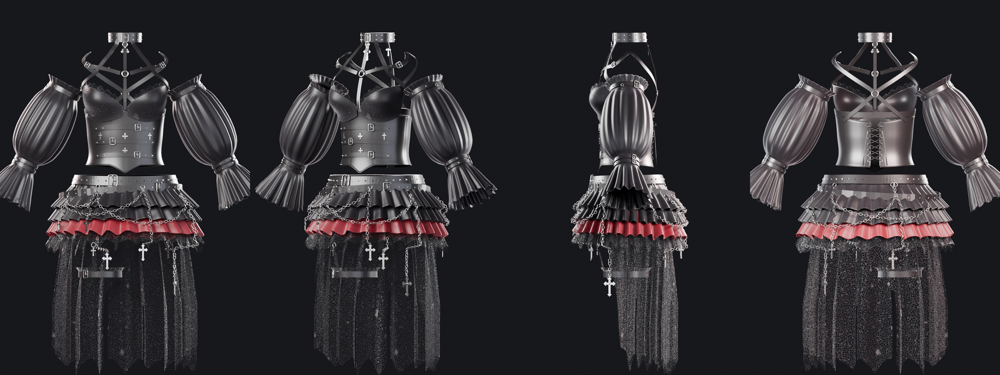

# Gothic Outfit – Blender model

A 3D model of just the outfit from the character sheet: gothic corset top and tiered ruffle skirt. The character's body is not included. Every piece is built from real geometry with UVs and materials.



## Files

| File | What it is |
|---|---|
| `gothic_outfit.blend` | **Open this in Blender (4.2+).** Modifiers are still live, and the materials are procedural (Cycles and EEVEE). |
| `gothic_outfit.glb` | glTF export with modifiers applied, for games, three.js, and other apps. |
| `gothic_outfit.fbx` | FBX export with modifiers applied, for Unity, Unreal, and Maya. |
| `build_gothic_outfit.py` | The generator script. Change the numbers in it and re-run to rebuild the whole outfit. |
| `preview_*.png` | Cycles preview renders. |

## Contents of the .blend

**`Gothic_Outfit` collection**, with everything parented to the `Gothic_Outfit` empty:

* **Outfit_Top**
  * `Top_Corset`: cropped leather corset. It has boning grooves, a pointed front, and piping. The lacing at the back has grommets, criss-cross laces, and a bow.
  * `Top_Straps`: front buckle straps, corset piping, and laces.
  * `Top_Bra_Cups` / `Top_Bra_Lace`: balconette cups with a lace overlay and scalloped lace trim.
  * `Top_Harness`: studded choker, halter V straps, a sternum O-ring, the X-back through a back O-ring, and the bra back band.
  * `Top_Sleeve_L` / `Top_Sleeve_R`: detached off-shoulder puff sleeves. Each has a frilled top, a gathered band, and a flared ruffle cuff.
  * `Top_Sleeve_Straps`: buckle bands on the sleeves.
  * `Top_Hardware`: buckles, studs, O-rings, grommets, and cross emblems and pendants.
* **Outfit_Skirt**
  * `Skirt_Ruffle_1` / `_2`: black ruffle tiers.
  * `Skirt_Ruffle_3_Red`: blood-red ruffle tier with a jagged hem.
  * `Skirt_Ruffle_4_Lace`: tattered black lace tier.
  * `Skirt_Overskirt_Tattered`: long, open-front, high-low sheer lace layer with a jagged hem and slits.
  * `Skirt_Belts`: studded waist belt and slanted hip belt.
  * `Skirt_Garter`: thigh garter with a lace frill, buckle, and suspender strap.
  * `Skirt_Hardware`: draped chains, hanging cross pendants, buckles, studs, and O-rings.

**`Reference_Body` collection** (hidden, not rendered, not exported): a simple mannequin the outfit was fitted to. Turn it on to preview the fit, or use it as a collision object for a cloth simulation.

## Specs

* Units are metres, Z is up, and the character faces −Y (Blender's Front view). The outfit is sized for a body about 1.68 m tall.
* The pose is an A-pose with the arms 28° from vertical, so the outfit is ready for rigging and weight transfer.
* It is about 290k triangles with modifiers applied. The base meshes, before Solidify and Subdivision, are much lighter. Lower or remove the `Subdivision` modifier for a game-ready LOD.
* Cloth pieces use **Solidify** and **Subdivision** modifiers, so you can adjust thickness and smoothness non-destructively.
* Materials:
  * `GO_Leather_Black`: grain bump and clear coat.
  * `GO_Satin_Black` and `GO_Satin_Red`: sheen.
  * `GO_Lace_Black` and `GO_Lace_Sheer`: procedural alpha-cut lace.
  * `GO_Metal_AntiqueSilver`
* Every piece has a `UVMap`, so you can replace the procedural materials with painted textures.

> Note: glTF and FBX can't carry Blender's procedural node materials. In the `.glb`/`.fbx` the lace exports as solid black fabric. Bake the lace alpha to a texture, or re-create it in the target engine, if you need see-through lace there.

## Rebuild or tweak

```bash
# inside Blender: open build_gothic_outfit.py in the Text Editor → Run Script
# headless, writes .blend/.glb/.fbx (+ previews with --render):
blender -b -P build_gothic_outfit.py -- --export ./out --render
# or with the pip `bpy` module (Python 3.11):
python build_gothic_outfit.py --export ./out --render
```

To change the body the outfit fits, edit `BODY_KEYS` and `BUMPS`. Each garment has its own function (`build_corset`, `build_sleeve`, the `Tier(...)` list in `build()`, and so on), and its lengths, fold counts, and flare are plain numbers.
